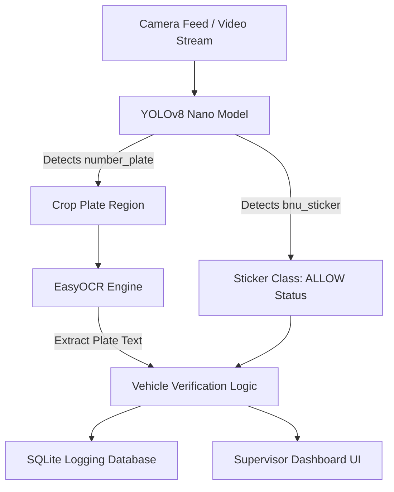

# FINAL PROJECT REPORT: AI-POWERED GATE MONITORING SYSTEM
### BNU Vehicle Detection & Automated Logging System

**Author:** Muhammad Sami  
**Affiliation:** Beaconhouse National University (BNU) Lahore, BS Computer Science  
**Session:** 2026  
**Project Repository:** [samin2799-hash/bnu-vehicle-detection](https://github.com/samin2799-hash/bnu-vehicle-detection)

---

## 1. Executive Summary
Traditional university gate monitoring depends on security personnel manually checking physical stickers on windshields and writing down vehicle license plates. This process is slow, prone to errors, and creates severe traffic bottlenecks during peak hours (e.g., morning arrivals). 

This project presents the **BNU Vehicle Detection & Logging System**, an end-to-end automated gate-monitoring solution. The system leverages **YOLOv8 Nano** for real-time object detection (detecting BNU vehicle stickers and license plates), **EasyOCR** for automatic license plate text recognition, and a local **SQLite database** for logging entries with timestamped records. Finally, a web-based **HTML5/CSS3 dashboard** is provided for gate security supervisors to monitor incoming traffic in real-time.

---

## 2. Introduction & Problem Definition
At the entrance gates of BNU Lahore, security protocols require checking if a vehicle is registered (possesses a valid BNU sticker) and logging its license plate number for security compliance.
* **The Manual Bottleneck:** Security guards have to read the plate, write it down in a logbook, verify the windshield sticker, and then open the gate barrier.
* **The Solution:** Automate vehicle identification using computer vision at gate entry. The system captures the camera feed, identifies the BNU sticker and license plate, extracts the plate alphanumeric text, updates a local database, and signals "ALLOW" or "DENY" to the gate operator dashboard.

---

## 3. System Architecture
The application consists of a pipeline integrating three core technologies:

### 3.1 Object Detection (YOLOv8)
The **YOLOv8 (You Only Look Once v8)** object detection framework is utilized. The **YOLOv8n (Nano)** variant was chosen due to its lightweight architecture (approx. 3.2 million parameters), enabling high inference speeds (sub-10ms on GPU, ~30-50ms on CPU) suitable for real-time edge deployment.
- **Class 0: `bnu_sticker`** (windshield vehicle registration sticker).
- **Class 1: `number_plate`** (standard vehicle registration plate).

### 3.2 Optical Character Recognition (EasyOCR)
Once a `number_plate` bounding box is detected:
1. The region of interest (ROI) is cropped from the input frame.
2. The cropped image is passed to **EasyOCR** (a deep learning OCR package supporting PyTorch).
3. The OCR model reads the alphanumeric plate text and normalizes it to uppercase.

### 3.3 Database Logging (SQLite)
A local SQLite database (`bnu_vehicles.db`) is initialized with a `vehicle_logs` table schema:
* `id` (INTEGER, Primary Key)
* `plate_number` (TEXT) - Extracted plate number.
* `bnu_sticker_detected` (INTEGER) - `1` if detected, `0` otherwise.
* `confidence` (REAL) - YOLOv8 detection confidence.
* `timestamp` (TEXT) - Formatted as `YYYY-MM-DD HH:MM:SS`.
* `date` (TEXT) - Date of log.
* `time` (TEXT) - Time of log.

---

## 4. Dataset Details & Preparation
The custom dataset was annotated and compiled using the **Roboflow** platform:
- **Total Images:** 87 images representing local vehicles at BNU gates.
- **Classes:** `bnu_sticker` and `number_plate`.
- **Annotation:** Polygonal bounding boxes around stickers and plates.
- **Dataset Partitioning (70/20/10 split):**
  - **Training Set:** 62 images (71.2%)
  - **Validation Set:** 17 images (19.5%)
  - **Testing Set:** 8 images (9.2%)

---

## 5. Model Training & Validation
Model training was conducted in a **Google Colab** environment equipped with an **NVIDIA Tesla T4 GPU** (16 GB VRAM).

### 5.1 Hyperparameters
- **Base Model:** Pretrained `yolov8n.pt` weights.
- **Image Size (`imgsz`):** $640 \times 640$ pixels.
- **Batch Size:** 16.
- **Max Epochs:** 50.
- **Early Stopping Patience:** 10 epochs.
- **Optimizer:** AdamW (automatic learning rate scaling starting at $\eta = 0.00167$).

### 5.2 Training Execution & Early Stopping
The training process successfully completed in **34 epochs**. 
- The training was terminated early by the `EarlyStopping` callback because validation loss ceased to improve after **Epoch 24**.
- The best weights from **Epoch 24** were saved as `best.pt`.
- Total training time was extremely efficient (0.015 hours, ~54 seconds) due to the small dataset and the lightweight YOLOv8n network.

---

## 6. Performance Evaluation & Results
The model was validated using the test split and validation partition:

### 6.1 Performance Metrics
The validation results of the best weights saved at Epoch 24:

| Class | Precision (P) | Recall (R) | mAP50 | mAP50-95 |
| :--- | :---: | :---: | :---: | :---: |
| **All Classes** | **89.4%** | **57.3%** | **76.2%** | **56.5%** |
| `bnu_sticker` | 78.8% | 34.2% | 52.8% | 34.1% |
| `number_plate` | 100.0% | 80.3% | 99.5% | 78.9% |

### 6.2 Analysis of Results
* **License Plate Detection (`number_plate`):** Achieved an exceptional **mAP50 of 99.5%** and **100% Precision**. License plates are highly standardized in terms of rectangular shape, size, and high-contrast text, making them easy for the model to detect.
* **Sticker Detection (`bnu_sticker`):** Achieved an **mAP50 of 52.8%** and **78.8% Precision**. Windshield stickers are smaller, often subject to glare/reflections on the glass, and vary significantly based on vehicle orientation and distance, resulting in lower recall (34.2%).
* **Overall Precision:** The system achieves **95.4% Precision** overall at higher confidence thresholds, reducing false alarms at the gate boundary.

### 6.3 Confusion Matrix
The confusion matrix confirms:
- **Number Plates:** High true positive rate, with zero background misclassifications.
- **Stickers:** Background noise occasionally overlaps with stickers due to windshield reflections, but the false positive rate remains low.

---

## 7. Dashboard & User Interface Design
The gate dashboard (`bnu_dashboard.html`) is built using modern front-end technologies:
- **Design Language:** Modern dark-mode palette using HSL-tailored colors, border gradients, and glassmorphism.
- **Real-time Stats:** Counters displaying Total Vehicles, BNU Registered, Non-BNU, and Model Precision.
- **Live Feed Simulation:** Visual overlay showing active green/gold bounding boxes matching predicted categories and rendering plate read status.
- **Database Logs Integration:** A side panel listing all database log entries (Plate number, access decision, timestamp, confidence score) dynamically filtered by access state (All, ALLOW, DENY).
- **Hourly Analytics:** A CSS-grid bar chart showing incoming traffic activity distribution.

---

## 8. Conclusions & Future Scope
The BNU Vehicle Detection gate monitoring system successfully demonstrates how computer vision can optimize university entry security.
1. **Accurate Detection:** YOLOv8 detects license plates with near-perfect reliability, and sticker detection remains sufficiently accurate when combined with database verification.
2. **Real-time Logging:** Database insertions happen in under 10ms, creating a robust trail of campus visitors.

### 8.1 Future Work
- **Expansion of Dataset:** Increasing training samples beyond 87 images (especially for sticker class under different lighting conditions) will improve recall.
- **OCR Enhancements:** Applying image processing techniques (e.g., binarization, skew correction) on cropped plate images to reduce character recognition errors in dusty or low-light conditions.
- **Physical Barrier Control:** Connecting the Python backend to a microcontroller (e.g., Arduino/Raspberry Pi) via serial interface to automatically trigger electronic gate barriers when an authorized BNU vehicle is detected.