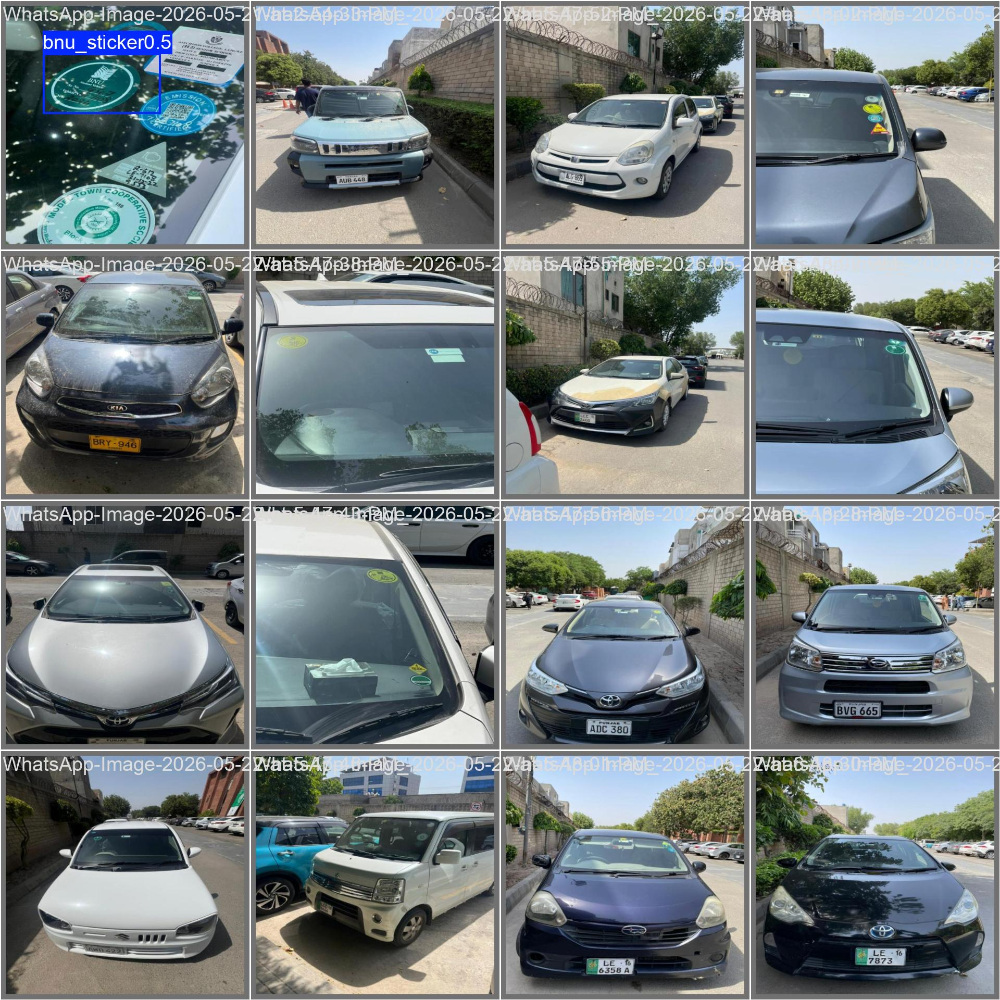
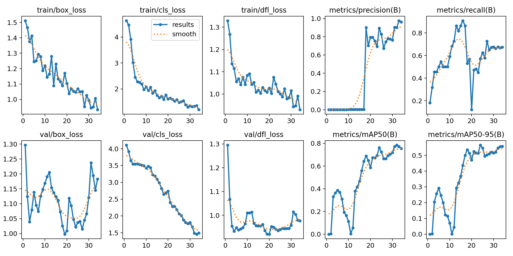
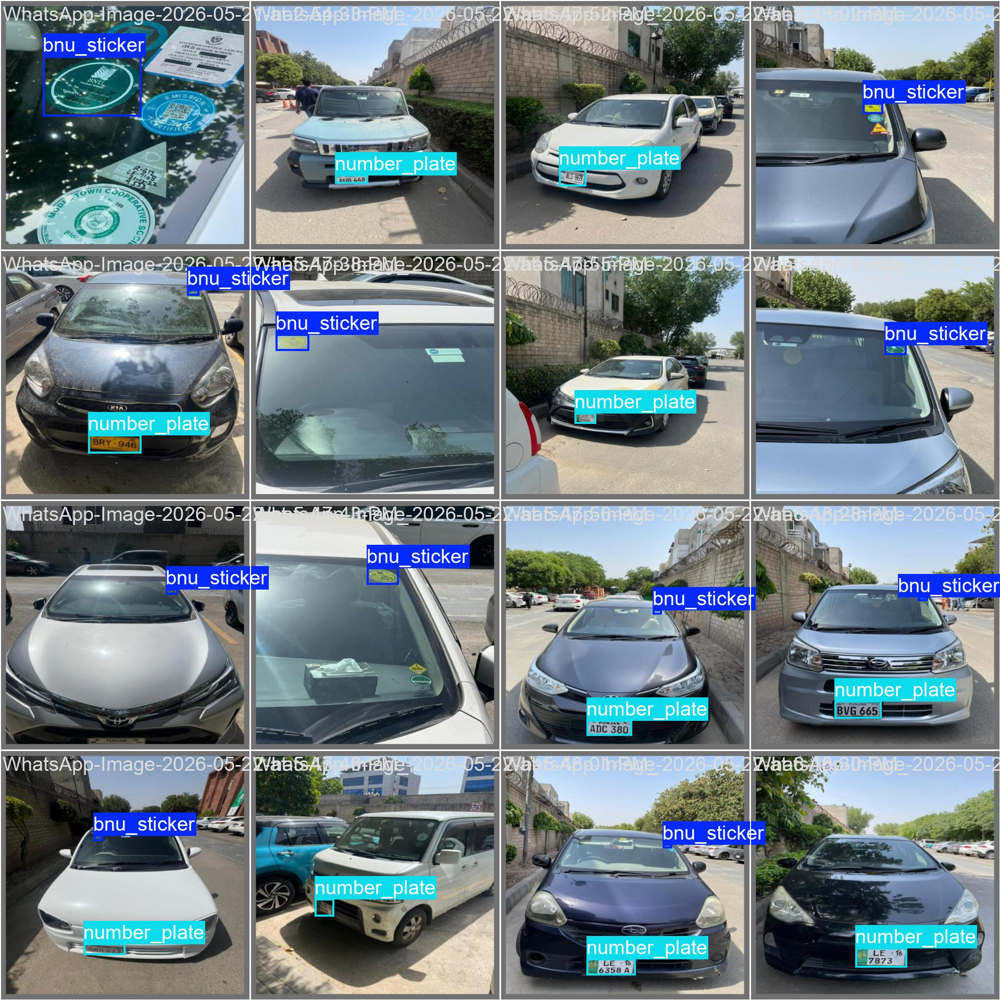
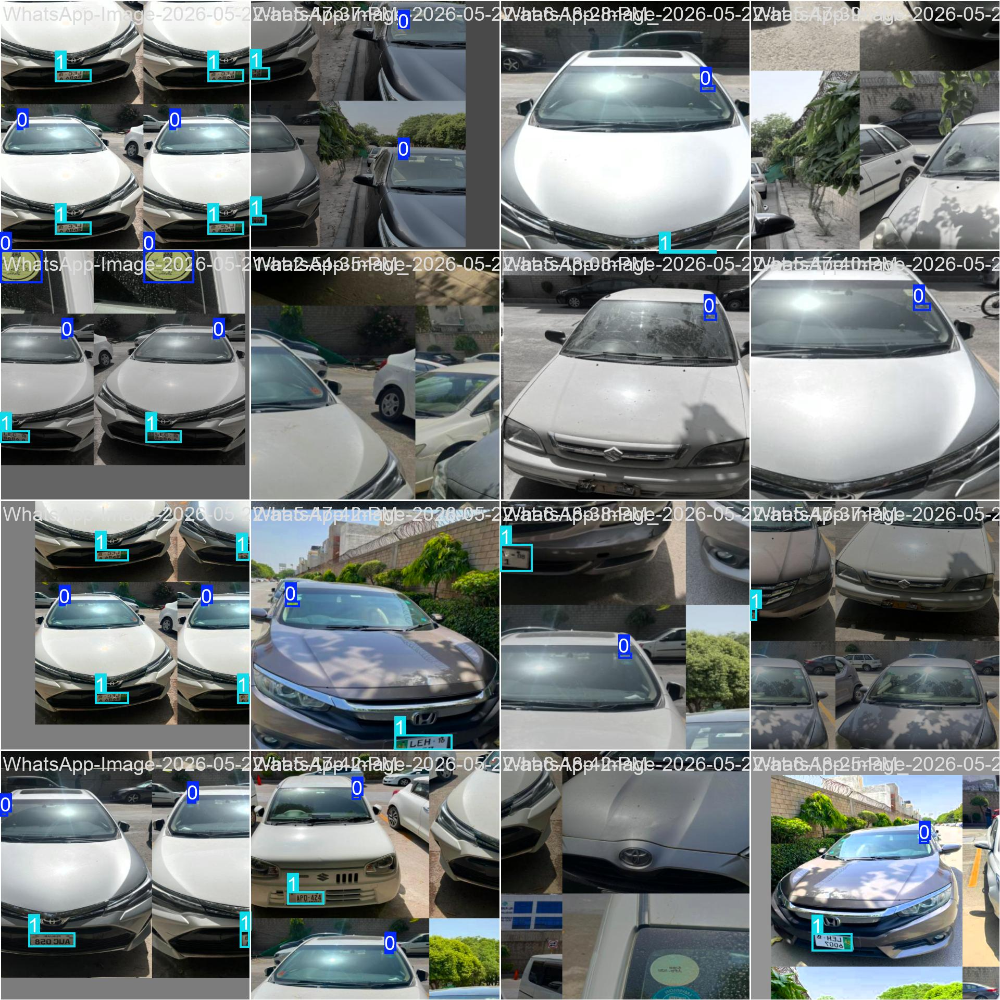

# BNU Vehicle Detection & Monitoring System

[](https://python.org)
[](https://ultralytics.com)
[](https://fastapi.tiangolo.com)
[](LICENSE)

> An AI-powered campus vehicle monitoring system that detects university stickers
> and reads number plates in real time using YOLOv8 and EasyOCR.



---

## Results

| Metric | Number Plates | Stickers |
|---|---|---|
| mAP50 | **99.5%** | **52.8%** |
| Precision | 100% | 78.8% |
| Recall | 80.3% | 34.2% |

Training curves and confusion matrix: [`08_Documentation_and_Results/`](08_Documentation_and_Results/)



---

## Problem Statement

BNU campus requires a system to automatically verify whether vehicles entering
the campus carry valid university stickers and have readable number plates —
without manual inspection at the gate.

This system processes live camera footage, detects both sticker presence and
plate text in real time, and logs every vehicle entry to a searchable database.

---

## System Architecture

```
Camera Feed
    ↓
YOLOv8 Detection (sticker + number plate bounding boxes)
    ↓
EasyOCR (plate text extraction)
    ↓
Confidence Filter (threshold: 0.7)
    ↓
SQLite Database (entries, violations log)
    ↓
FastAPI Backend
    ↓
Web Dashboard (live feed + entry log)
```

---

## Features

- Real-time YOLOv8 object detection for two classes: `vehicle_sticker`, `number_plate`
- EasyOCR-powered number plate text extraction
- Confidence-filtered OCR — low-confidence reads flagged as "unreadable" rather than logged as wrong plate numbers
- FastAPI REST backend with live detection endpoint
- SQLite database logging every vehicle entry with timestamp, plate text, and sticker status
- Web dashboard showing live camera feed and today's entry log

---

## Tech Stack

| Component | Technology |
|---|---|
| Detection Model | YOLOv8 (Ultralytics) |
| OCR | EasyOCR |
| Backend | FastAPI + Uvicorn |
| Database | SQLite |
| Frontend | HTML/CSS/JS |
| Training | Google Colab (GPU) |

---

## Installation

### Prerequisites
- Python 3.10+
- Webcam or IP camera feed

### Setup

```bash
git clone https://github.com/AneequeShahid/bnu-vehicle-detection-ai-project
cd bnu-vehicle-detection-ai-project

pip install -r 03_Source_Code/requirements.txt
```

### Download model weights

Download `best.pt` from [GitHub Releases](../../releases) and place it in `05_Trained_Models/`.

### Run

```bash
cd 07_Demo_Application/backend
python detect.py
```

Open `07_Demo_Application/frontend/bnu_dashboard.html` in a browser.

---

## Database Schema

```sql
CREATE TABLE entries (
  id          INTEGER PRIMARY KEY AUTOINCREMENT,
  timestamp   TEXT NOT NULL,
  plate_text  TEXT,
  plate_conf  REAL,
  has_sticker INTEGER,
  flagged     INTEGER DEFAULT 0
);
```

---

## Training

Model was trained on a custom dataset of BNU campus vehicles:
- Annotated with Roboflow
- YOLOv8n architecture
- 50 epochs
- Train/val/test split: 80/10/10

See [`04_Dataset/README.md`](04_Dataset/README.md) for dataset details.

---

## Sample Detections

| Detection 1 | Detection 2 | Detection 3 |
|---|---|---|
|  |  |  |

---

## Project Structure

```
bnu-vehicle-detection-ai-project/
├── 03_Source_Code/
│   ├── backend/        FastAPI server + detector pipeline
│   ├── frontend/       Web dashboard
│   └── requirements.txt
├── 04_Dataset/         Dataset info and README
├── 05_Trained_Models/  Model weights (download from Releases)
├── 06_Confusion_Matrix/ Confusion matrix outputs
├── 07_Demo_Application/ Runnable demo
├── 08_Documentation_and_Results/ mAP curves, training results
├── media/              Screenshots for README
├── results/
│   └── sample_detections/ Detection output samples
└── requirements.txt
```

---

## Academic Context

Final year project for AI/ML course (CSC-233), Beaconhouse National University, Lahore.

---

*Built by [Aneeque Shahid](https://github.com/AneequeShahid)*
